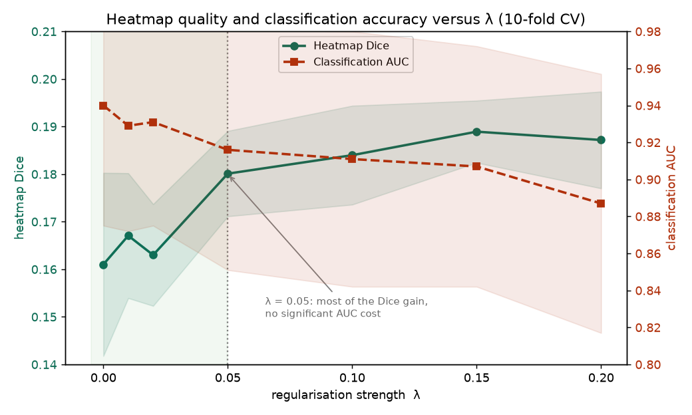
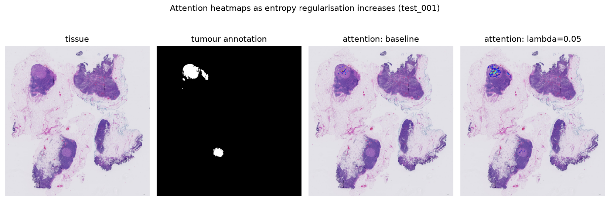
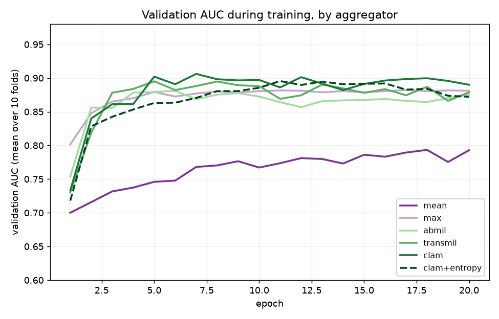

# Attention-Regularised Multiple Instance Learning for Breast Cancer Metastasis Detection

Deep learning for detecting breast cancer metastasis in lymph node whole slide images (WSIs), with a focus on making the model's attention heatmaps more faithful to the true extent of disease. This is the codebase for an MSc dissertation at the University of York.

## Summary

Attention-based multiple instance learning (MIL) methods such as CLAM classify gigapixel pathology slides while producing an attention heatmap that shows where the model is looking. These heatmaps are the interface a pathologist uses to verify an automated decision, but CLAM's softmax attention tends to concentrate on a few patches, so the heatmap can under-represent the disease even when the slide-level prediction is correct.

This project adds a single **attention entropy regularisation** term to the CLAM training objective that rewards a less concentrated attention distribution. It is a one-parameter modification (lambda) that adds no parameters to the model and recovers standard CLAM exactly at lambda = 0.

## Key result

Evaluated on the CAMELYON16 benchmark with 10-fold cross-validation:

- **Heatmap localisation improves significantly.** Mean Dice against expert tumour annotations rises from 0.160 to 0.181 at lambda = 0.05 (paired t-test p < 0.0001, Cohen's d = 2.85).
- **Classification accuracy is preserved.** Cross-validated AUC is unchanged (0.9248 with and without the term, p = 1.000).
- **Best localiser of any aggregator tested.** Against mean/max pooling, ABMIL, CLAM, and a transformer aggregator, the proposed method achieves the highest heatmap Dice while remaining statistically tied on classification.
- **Fewer missed metastases.** At the chosen operating point, false negatives fall by 34% relative to baseline.

The trade-off between heatmap quality and classification accuracy as the regularisation strength lambda varies, cross-validated over 10 folds:



lambda = 0.05 is adopted as the operating point: it captures most of the interpretability gain while classification AUC remains statistically indistinguishable from the baseline.

## The method in action

Baseline CLAM (lambda = 0) versus entropy-regularised attention (lambda = 0.05) on a test slide. The regularised model spreads attention more fully across the tumour region and recovers a second focus the baseline under-attends:



A notable finding is the dissociation between classification and interpretability: the transformer aggregator classifies well (AUC 0.937) but localises poorly (Dice 0.068), showing that accuracy and explanation quality are distinct properties.

## Method

The training objective adds a weighted attention-entropy term to the standard CLAM loss:

```
L = L_CLAM - lambda * H(a),    where    H(a) = - sum a_i log a_i
```

Here `a` is the attention distribution over a slide's patches and `H(a)` is its Shannon entropy. Subtracting the term rewards higher entropy (less concentrated attention). lambda = 0 reduces the objective to standard CLAM, making the comparison a controlled, single-parameter ablation.

## Pipeline

1. **Preprocessing** - tissue segmentation (HSV + Otsu), multi-scale patch extraction (20x detail paired with 5x context), and quality filtering.
2. **Feature extraction** - a frozen ResNet-50 encodes each patch into a 4096-dimensional vector; features are cached once so all aggregators train on the same representation.
3. **Aggregation** - mean/max pooling, ABMIL, CLAM, a simplified TransMIL, and the proposed CLAM + entropy, all compared under identical conditions.
4. **Evaluation** - classification (AUC, precision, recall, F1) and heatmap quality (Dice, IoU, attention entropy), with a lesion-size stratified analysis.

Validation AUC during training, showing all aggregators converge within the epoch budget and the pooling baselines trail the attention-based methods:



## Repository structure

```
code/
  segment_tissue.py         tissue segmentation
  extract_patches.py        multi-scale patch extraction
  extract_features.py       ResNet-50 feature extraction
  process_slide.py          per-slide orchestration
  models.py                 all aggregators + entropy regularisation
  dataset.py                data loading
  train.py                  training loop and model factory
  make_splits.py            stratified cross-validation splits
  evaluate_heatmap.py       Dice/IoU heatmap evaluation
  evaluate_comparison.py    cross-validated aggregator AUC
  compare_dice.py           cross-validated aggregator Dice
  classification_metrics.py precision/recall/F1/confusion
  small_focus_analysis.py   micro vs macro stratification
  knee_plot.py              lambda trade-off figure
  plot_training_curves.py   convergence figures
  *.sbatch                  Slurm batch scripts
assets/                     result figures
outputs/                    result CSVs (data and checkpoints are gitignored)
```

## Reproducing

Data (the CAMELYON16 WSIs), cached features, and model checkpoints are not included owing to their size; the WSIs are obtained from the public [CAMELYON16 dataset](https://camelyon16.grand-challenge.org/). Experiments were run on an HPC cluster (Slurm, NVIDIA A40 GPUs) with PyTorch 2.7.1, CUDA 12.6, and Python 3.12. The `.sbatch` files show the exact job configurations.

Typical flow: preprocess and cache features for all slides, generate cross-validation splits, train each aggregator across folds, then run the evaluation scripts to produce the result CSVs.

## Dataset

[CAMELYON16](https://camelyon16.grand-challenge.org/): 399 H&E whole slide images of sentinel axillary lymph nodes (270 train, 129 test), with pixel-level tumour annotations on positive slides and a metastasis-size category (micro / macro) used for the small-focus analysis.

## Acknowledgements

Developed as an MSc dissertation project at the University of York. Computation was carried out on the University's Viking Research Computing cluster.
